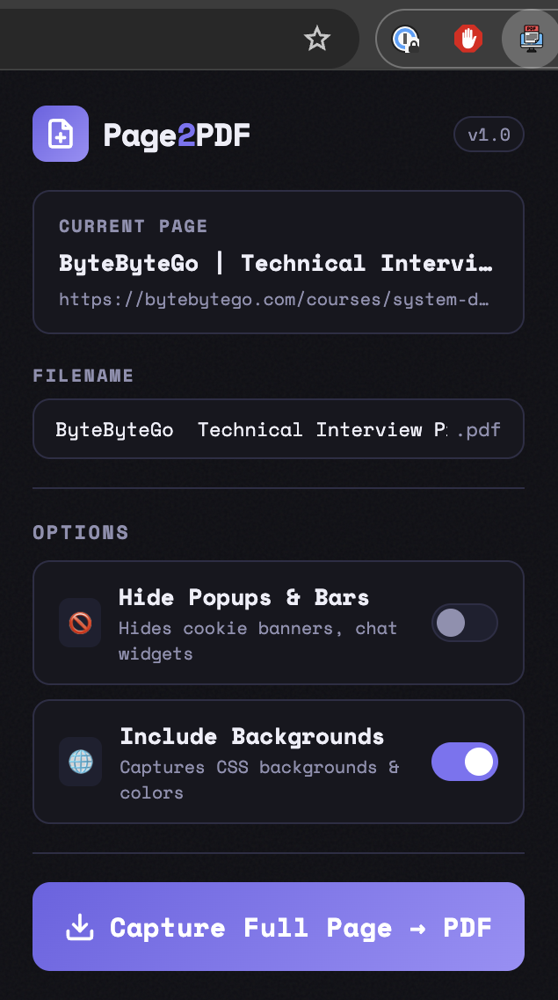

# Page2PDF — Full Page Capture Chrome Extension

> A lightweight Chrome extension that silently scrolls, lazy-loads, and exports any webpage to a pixel-perfect PDF in one click — powered by Chrome's native `Page.printToPDF` API.


---

## Features

- **Full-page capture** — captures the entire scrollable page, not just the visible viewport
- **Pixel-perfect text** — uses Chrome's native print engine so fonts, spacing, and layout are always accurate
- **Lazy-load handling** — automatically scrolls the page before capturing to trigger lazy-loaded images and content
- **Idle-aware settling** — waits for the browser's main thread to go idle (layout, paint, image decoding complete) before capturing, instead of a fixed timer
- **Editable filename** — pre-fills the filename from the page title; edit it before saving
- **Hide popups & overlays** — optionally removes cookie banners, chat widgets, sticky headers, and fixed overlays before saving
- **CSS backgrounds** — captures background colors, gradients, and images
- **Open after save** — "Open" button appears after capture to view the PDF immediately
- **Persistent settings** — all options are remembered across popup opens via `chrome.storage.sync`
- **90-second timeout** — captures that hang (unresponsive page, extreme size) fail gracefully with a clear message
- **No server, no uploads** — everything runs 100% locally inside your browser

---



---

## Installation

### Step 1 — Clone the repo

```bash
git clone https://github.com/your-username/page2pdf.git
cd page2pdf
```

### Step 2 — Load in Chrome

1. Open Chrome and navigate to `chrome://extensions/`
2. Enable **Developer mode** (toggle in the top right)
3. Click **"Load unpacked"**
4. Select the `page2pdf` folder
5. The Page2PDF icon appears in your toolbar

---

## Usage

1. Navigate to any webpage you want to save
2. Click the **Page2PDF** icon in the Chrome toolbar
3. Edit the filename if needed
4. Adjust options (hide popups, backgrounds, dark mode)
5. Click **"Capture Full Page → PDF"**
6. The PDF saves to your Downloads folder — click **Open** to view it immediately

---

## How It Works

```
User clicks capture
       ↓
Popup sends options to background service worker
       ↓
Background attaches Chrome Debugger (CDP)
       ↓
Scrolls full page height to trigger lazy-loaded content
       ↓
Waits for browser idle (requestIdleCallback) — images and fonts fully decoded
       ↓
Measures true page dimensions by walking the DOM
       ↓
Optionally hides popups, fixed overlays, and sticky bars
       ↓
Calls Page.printToPDF via CDP with exact paper dimensions
       ↓
PDF base64 returned → chrome.downloads saves it locally
       ↓
Debugger detaches cleanly / dark mode emulation reset
```

The extension uses the **Chrome DevTools Protocol** (`Page.printToPDF`) rather than a canvas screenshot library. This gives pixel-perfect text rendering, correct font spacing, and reliable image capture — the same engine Chrome uses for Ctrl+P → Save as PDF.

Paper dimensions are calculated from the true page height (by walking the DOM and finding the lowest element), so the PDF is always a single scrollable page with no empty trailing pages.

---

## File Structure

```
page2pdf/
├── manifest.json        # Extension config (Manifest V3)
├── background.js        # Service worker — CDP orchestration
├── popup.html           # Extension popup UI + styles
├── popup.js             # Popup logic, settings, state management
├── content.js           # Reserved for future use
├── icons/
│   ├── icon16.png
│   ├── icon48.png
│   └── icon128.png
└── generate_icons.py    # Script used to generate the PNG icons
```

---

## Options

| Option | Default | Description |
|---|---|---|
| Filename | Page title | Editable before capture — illegal characters are stripped automatically |
| Hide Popups & Bars | Off | Hides cookie banners, chat widgets, `position:fixed` overlays, and sticky bars |
| Include Backgrounds | On | Captures CSS background colors, gradients, and images |

---

## Permissions

| Permission | Why it's needed |
|---|---|
| `activeTab` | Access the current tab to capture it |
| `tabs` | Read the page title and URL for display in the popup |
| `downloads` | Save the generated PDF to the Downloads folder |
| `debugger` | Attach Chrome DevTools Protocol to call `Page.printToPDF` |
| `storage` | Persist option toggle states across popup opens |

No data leaves your machine. No analytics. No external requests.

---

## Troubleshooting

| Issue | Fix |
|---|---|
| "A capture is already in progress" | DevTools is open on that tab, or another capture is running. Close DevTools and try again |
| "This page cannot be captured" | The extension cannot attach to `chrome://`, `chrome-extension://`, or `about:` pages. Navigate to a regular webpage |
| PDF is empty | The page may be blocking the print engine. Refresh the page and try again |
| Missing images in PDF | Some sites block cross-origin image loading. Disabling other privacy extensions may help |
| Chrome shows "debugger attached" banner | This is a Chrome security requirement when using CDP — it disappears automatically when capture finishes |
| Capture times out | The page took longer than 90 seconds to settle. Try on a faster connection, or refresh and retry |
| Slow on large pages | Scrolling to trigger lazy-loaded content takes time proportional to page height — this is expected |

---

## Contributing

Pull requests are welcome. For major changes please open an issue first to discuss what you'd like to change.

---

## License

MIT
